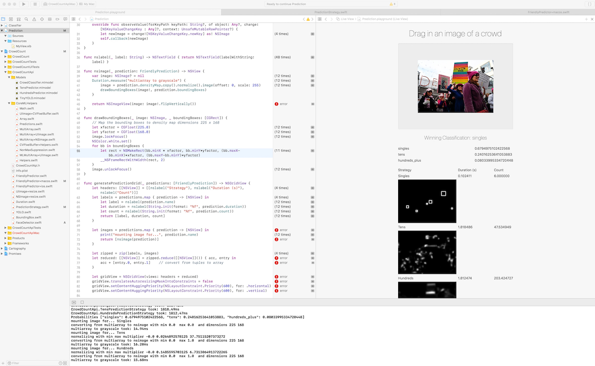

# Overview

The Apple CoreML can be divided into two implementations:

1. macOS Prediction Playground
2. iOS Crowd Counting Application

## macOS Prediction Playground

Ability to drag and drop an image to see the results of different prediction strategies.

## iOS Crowd Counting

Coming soon.

## Setup

1. Use Xcode 10+
2. Install carthage
3. carthage bootstrap
4. Build every target, including CrowdCountApi and CrowdCountApiMac
