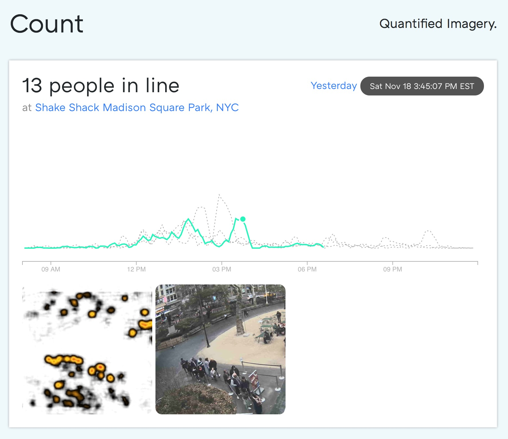

# Overview

Rails application that periodically pulls an image from the Shake Shack Camera
in Madison Square Park, and plots the number of people in line.



## Setup

Usual rails setup:

```bash
brew install graphicsmagick postgresql redis
yarn install
bundle
rake db:create db:migrate
rails s
```

### secrets folder and google cloud

```bash
$ cat .envrc
export CLOUDSDK_PYTHON=/Users/dimroc/.pyenv/versions/miniconda2-4.1.11/bin/python2
export GOOGLE_APPLICATION_CREDENTIALS=../secrets/gcloudstorage.development.json
gcloud config set project counting-company-production
```

### Available Tasks

```
# Main one
rake prediction:shakecam                # Save an image from shakecam and make an ml prediction against it

rake prediction:backfill_mall_v2        # Walks through all old frames and generates predictions with the v2 engine
rake prediction:mall                    # Pull the mall dataset and generate predictions
rake db:restore_gcs                     # Restores the database dump from GCS
```

### Create the first admin user:

```
rails console
User.create(email: "your@email.com", admin: true, password: "password123", password_confirmation: "password123")
```
